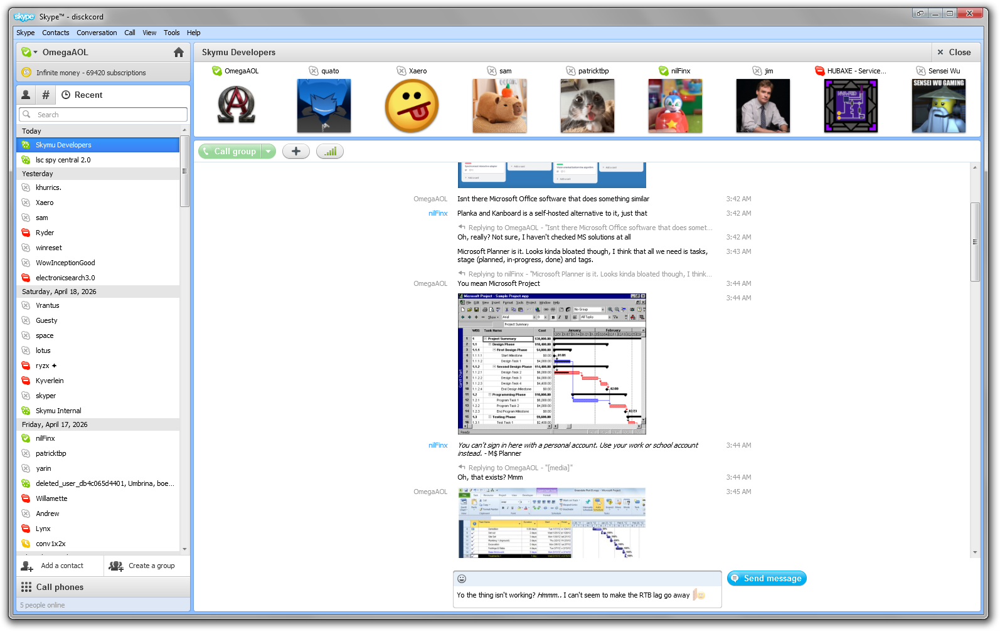
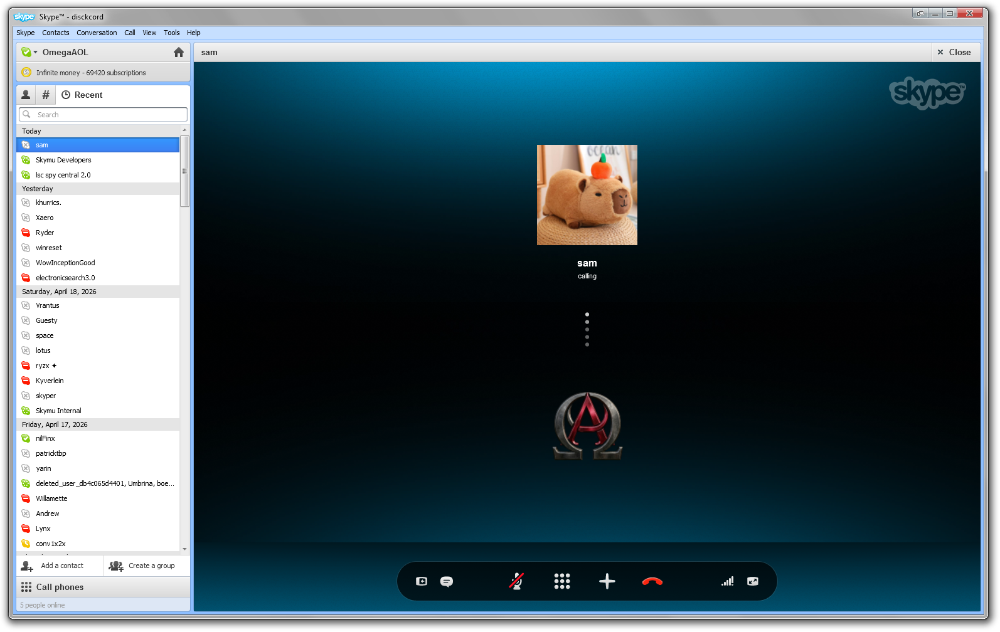

 

# What is Skymu?
Skymu is a modern multiprotocol IM client that looks like classic versions of Skype, with skins perfectly resembling Skype 5, 6, and 7. Currently supported messaging services include Discord, Matrix, Tox, and MSNP11.

# Build Guide

Use any version of Visual Studio from 2019 Community (recommended) onwards. Build Yggdrasil (formerly MiddleMan) first and the solution afterwards.

 

 

# How to create the installer

* Install NSIS (Nullsoft Scriptable Install System) on your computer, using the latest version is highly recommended
* Build Skymu in the "Release" configuration
* Go to the NSIS directory and right click the script you want to use (depending on whether you want a standard installer or beta installer) and click "Compile NSIS Script"

# Open-source software used

| Software | Author | License | Used in | Source code |
|---|---|---|---|---|
| BouncyCastle.Cryptography | Legion of the Bouncy Castle | [Apache-2.0 AND MIT](https://choosealicense.com/licenses/apache-2.0/) | Discord, Yggdrasil | [GitHub repository](https://github.com/bcgit/bc-csharp) |
| CommunityToolkit.Mvvm | Microsoft | [MIT](https://choosealicense.com/licenses/mit/) | Skymu | [GitHub repository](https://github.com/CommunityToolkit/dotnet) |
| Concentus | Logan Stromberg | [BSD-3-Clause](https://choosealicense.com/licenses/bsd-3-clause/) | Discord | [GitHub repository](https://github.com/lostromb/concentus) |
| Google.Protobuf | Google | [BSD-3-Clause](https://choosealicense.com/licenses/bsd-3-clause/) | Discord | [GitHub repository](https://github.com/protocolbuffers/protobuf) |
| Markdig | Alexandre Mutel | [BSD-2-Clause](https://choosealicense.com/licenses/bsd-2-clause/) | Skymu | [GitHub repository](https://github.com/xoofx/markdig) |
| Microsoft.CSharp | Microsoft | [MIT](https://choosealicense.com/licenses/mit/) | Discord, Yggdrasil | [GitHub repository](https://github.com/dotnet/runtime) |
| Microsoft.Data.Sqlite | Microsoft | [MIT](https://choosealicense.com/licenses/mit/) | Skymu, Skype DB Browser | [GitHub repository](https://github.com/dotnet/dotnet) |
| NAudio.Core | Mark Heath | [MIT](https://choosealicense.com/licenses/mit/) | Discord, Stub, Tox | [GitHub repository](https://github.com/naudio/NAudio) |
| NAudio.WinMM | Mark Heath | [MIT](https://choosealicense.com/licenses/mit/) | Discord, Stub, Tox | [GitHub repository](https://github.com/naudio/NAudio) |
| NLayer.NAudioSupport | Mark Heath | [MIT](https://choosealicense.com/licenses/mit/) | Stub | [GitHub repository](https://github.com/naudio/NLayer) |
| QRCoder | Shane32 | [MIT](https://choosealicense.com/licenses/mit/) | Skymu | [GitHub repository](https://github.com/Shane32/QRCoder) |
| SharpZipLib | ICSharpCode | [MIT](https://choosealicense.com/licenses/mit/) | Discord | [GitHub repository](https://github.com/icsharpcode/SharpZipLib) |
| System.Net.WebSockets.Client.Managed | PingmanTools | [MIT](https://choosealicense.com/licenses/mit/) | Skymu, Discord, Matrix | [GitHub repository](https://github.com/PingmanTools/System.Net.WebSockets.Client.Managed) |
| System.Runtime.CompilerServices.Unsafe | Microsoft | [MIT](https://choosealicense.com/licenses/mit/) | Skymu | [GitHub repository](https://github.com/dotnet/runtime) |
| System.Text.Json | Microsoft | [MIT](https://choosealicense.com/licenses/mit/) | Skymu, Discord, Matrix | [GitHub repository](https://github.com/dotnet/dotnet) |
| System.Threading.Channels | Microsoft | [MIT](https://choosealicense.com/licenses/mit/) | Skymu, Discord, Stub, Tox | [GitHub repository](https://github.com/dotnet/dotnet) |
| TrayIcon | nullsoftware | [MIT](https://choosealicense.com/licenses/mit/) | Skymu | [GitHub repository](https://github.com/nullsoftware/TrayIcon) |

